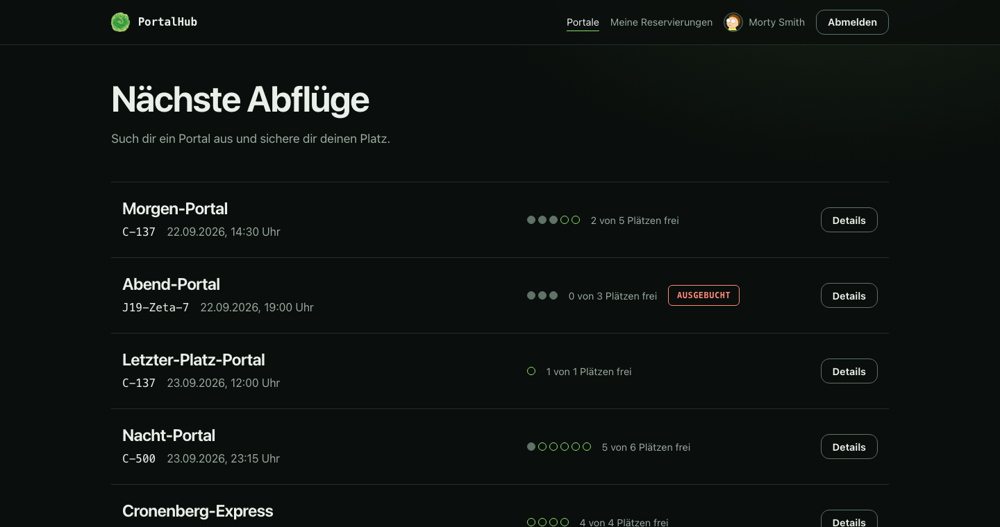

# PortalHub

Multiuser-Webapplikation im Stil von Rick and Morty (Modul M223). Reisende sehen Portale zu verschiedenen Dimensionen und reservieren einen Platz für die Reise. Ein Portal nimmt nie mehr Reservierungen an, als es Plätze hat, auch wenn mehrere Reisende gleichzeitig um den letzten Platz konkurrieren. Rick (Admin) verwaltet Portale, Reservierungen und Benutzer und sieht ein Aktivitätsprotokoll. Jeder Benutzer kann sein Profil und Passwort ändern und ein Bild aus einer festen Auswahl wählen.



Was und warum (Anforderungen, ERM, Breadboards, Locking-Konzept): [docs/spec.md](docs/spec.md). Stand der Umsetzung und Prüfung der Anforderungen: [docs/umsetzung.md](docs/umsetzung.md). Diese README erklärt nur, wie die Applikation ausgeführt wird.

## Technologie-Stack

| Bereich | Technologie | Version |
| --- | --- | --- |
| Sprache | Ruby | 4.0.6 (siehe `.ruby-version`) |
| Framework | Ruby on Rails | 8.1.3.1 |
| Datenbank | SQLite 3 (Gem `sqlite3`) | 2.9.6 |
| Webserver | Puma | 8.0.2 |
| Frontend | Hotwire, Gem `turbo-rails` | 2.0.23 |
| | Hotwire, Gem `stimulus-rails` | 1.3.4 |
| Assets | Propshaft | 1.3.2 |
| JavaScript | importmap-rails (kein JavaScript-Build) | 2.2.3 |
| Anmeldung | `has_secure_password` mit bcrypt | 3.1.22 |
| Tests | Minitest, Fixtures | 6.0.6 |
| Stil | Rubocop mit rubocop-rails-omakase | 1.91.0 und 1.1.0 |
| Sicherheit | Brakeman und bundler-audit | 8.0.6 und 0.9.3 |
| Schrift | Geist und Geist Mono (SIL Open Font License, selbst gehostet) | Dateien in `app/assets/fonts` |

## Voraussetzungen

- Ruby 4.0.6, zum Beispiel über [rbenv](https://github.com/rbenv/rbenv) (`rbenv install 4.0.6`)
- Bundler (kommt mit Ruby) und die SQLite-3-Bibliothek des Betriebssystems
- Ein aktueller Browser: Chrome ab 120, Firefox ab 121 oder Safari ab 17.2. Ältere Browser weist Rails mit `allow_browser :modern` ab.

## Installation und Start

```bash
bin/setup --skip-server   # Gems installieren, Datenbank anlegen, Demo-Daten laden
bin/dev                   # Server starten: http://localhost:3000
```

`bin/setup` legt die Datenbank `storage/development.sqlite3` aus `db/schema.rb` an und lädt beim ersten Mal die Demo-Daten. Ohne `--skip-server` startet es den Server gleich mit.

## Datenbank und Demo-Daten

Fünf Tabellen: `users`, `portals`, `bookings`, `sessions` und `activities` (Aktivitätsprotokoll). Das Schema steht in `db/schema.rb`, das ERM mit allen Spalten in [docs/umsetzung.md](docs/umsetzung.md).

Die Demo-Daten stehen in `db/seeds.rb` und lassen sich beliebig oft neu laden, ohne Duplikate zu erzeugen:

```bash
bin/rails db:seed
```

Sie enthalten fünf Portale mit Abflugzeiten relativ zu heute: mehrere kommende, ein volles ("Abend-Portal") und ein bereits abgeflogenes ("Gestern-Portal").

## Demo-Konten

Alle Konten haben das Passwort `wubba-lubba`.

| E-Mail | Name | Rolle |
| --- | --- | --- |
| `rick@portalhub.test` | Rick Sanchez | Admin (verwaltet Portale, Reservierungen und Benutzer, sieht das Protokoll) |
| `morty@portalhub.test` | Morty Smith | Reisender |
| `summer@portalhub.test` | Summer Smith | Reisender |
| `beth@portalhub.test` | Beth Smith | Reisender |
| `birdperson@portalhub.test` | Birdperson | Reisender |

Eine Selbstregistrierung gibt es nicht, neue Benutzer legt Rick unter "Admin", "Benutzer" an. Für den Wettlauf um den letzten Platz melde dich in zwei getrennten Browserfenstern (eines davon privat) als zwei verschiedene Reisende an und reserviere dasselbe Portal.

## Tests

```bash
bin/rails test                                          # alle Tests
bin/rails test test/models/portal_concurrency_test.rb   # die zentrale Fachregel: gleichzeitige Reservierungen
bin/rails test test/integration/admin_access_test.rb:6  # ein einzelner Test (Datei:Zeile)
bin/ci                                                  # alles wie in der Abgabe: Style, Sicherheit, Tests, Seeds
```

Die Bestätigungsdialoge (Stornieren, Löschen) brauchen echtes JavaScript und lassen sich deshalb nicht mit Rails-Tests prüfen. Dafür gibt es `node script/browser_check.mjs` (Node 22 oder neuer, ein Chromium-Browser wie Brave oder Chrome, laufender Server). Der Test verändert die Entwicklungsdaten, danach `bin/rails db:seed` ausführen. Details im Kopf des Skripts.

Die Tests prüfen die zentrale Fachregel (nie mehr Reservierungen als Plätze, auch bei gleichzeitigen Anfragen) sowie erlaubte und verweigerte Zugriffe für Besucher, Reisende und Admin. Wie die Sperre funktioniert und was die Tests beweisen, steht in [docs/adr/0002-capacity-enforced-with-portal-lock.md](docs/adr/0002-capacity-enforced-with-portal-lock.md).

## Bildnachweis

Die Bilder (Portal, Portal Gun, Rick und die Avatare) stammen aus der Serie Rick and Morty (© Adult Swim) und werden nur für dieses Schulprojekt verwendet. Die Schrift Geist steht unter der SIL Open Font License.

## Weitere Dokumentation

- [docs/spec.md](docs/spec.md): Anforderungen, ERM, Breadboards, Locking und Transaktionen
- [docs/umsetzung.md](docs/umsetzung.md): erreichter Stand, Abweichungen, Prüfung der Anforderungen, Screens
- [docs/adr/](docs/adr/): Architekturentscheidungen
- [CONTEXT.md](CONTEXT.md): Glossar der Fachbegriffe
