# PortalHub: Umsetzung und Prüfung

Stand: 21.09.2026. Diese Datei ergänzt [spec.md](spec.md) (Was und Warum) um den erreichten Stand, die Abweichungen vom genehmigten Antrag, offene Punkte und die Prüfung der Anforderungen mit ihren Ergebnissen. Wie die Applikation ausgeführt wird, steht in der [README](../README.md).

## 1. Erreichter Stand

Alle acht funktionalen Anforderungen des Antrags sind umgesetzt, dazu die Erweiterungen aus dem nächsten Abschnitt. Die Tests laufen vollständig durch (142 Tests, `bin/rails test`), ebenso das gesamte lokale CI (`bin/ci`: Rubocop, bundler-audit, importmap-Audit, Brakeman, Tests, Seed-Lauf).

| Nr. | Funktionale Anforderung | Ergebnis | Nachweis (Tests) |
| --- | --- | --- | --- |
| 1 | Benutzer können sich anmelden | erfüllt | `authentication_test.rb` |
| 2 | Benutzer können verfügbare Portale ansehen | erfüllt | `portals_test.rb` |
| 3 | Benutzer sehen die Anzahl der freien Plätze | erfüllt | `portals_test.rb` (Liste, Details, Sitzpunkte) |
| 4 | Benutzer können einen Platz reservieren | erfüllt | `bookings_test.rb` |
| 5 | Benutzer können ihre Reservierungen ansehen | erfüllt | `my_bookings_test.rb` |
| 6 | Benutzer können ihre Reservierungen stornieren | erfüllt | `my_bookings_test.rb` |
| 7 | Ein Administrator kann Portale erstellen, bearbeiten und löschen | erfüllt | `admin_portals_test.rb`, `admin_bookings_test.rb` |
| 8 | Ein Portal darf seine maximale Kapazität nicht überschreiten | erfüllt | `portal_concurrency_test.rb`, `bookings_test.rb`, `admin_portals_test.rb` |

### Erweiterungen nach dem Antrag

Der Kompetenznachweis verlangt für eine Multi-User-Applikation weitere Funktionen, die im genehmigten Antrag nicht standen. Sie wurden nachträglich ergänzt und sind in [spec.md](spec.md) beschrieben, dort auch als Text-Breadboards. Die handgezeichneten Skizzen des Antrags (`breadboard.svg`, `wireframes.svg`) sind unverändert.

| Erweiterung | Was sie tut | Nachweis (Tests) |
| --- | --- | --- |
| Benutzerprofil | Jeder Benutzer sieht seine Daten und ändert Name, E-Mail und Passwort (das aktuelle Passwort ist nötig, danach enden die anderen Sitzungen). | `profile_test.rb` |
| Benutzerverwaltung | Rick legt Benutzer an, ändert Name, E-Mail, Rolle und Passwort und löscht Benutzer. Er kann sich nicht selbst löschen und seine eigene Rolle nicht ändern, und der letzte Admin kann nie herabgestuft oder gelöscht werden. Ein neues Passwort oder eine neue Rolle beendet die Sitzungen des Benutzers. | `admin_users_test.rb`, `user_test.rb` |
| Aktivitätsprotokoll | Rick sieht, wer wann was getan hat: Anmeldungen (auch fehlgeschlagene), Reservierungen, Stornierungen, Änderungen an Portalen, Benutzern und Profilen, filterbar nach Aktion und Benutzer. Einträge bleiben nach dem Löschen eines Benutzers lesbar. | `activity_log_test.rb` |
| Fehlerseiten | 404, 422, 500, 400 und "Browser zu alt" sind deutsch und im Design der Applikation statt der englischen Rails-Standardseiten. | `error_pages_test.rb` |

### Screens

| | |
| --- | --- |
|  Anmelden | 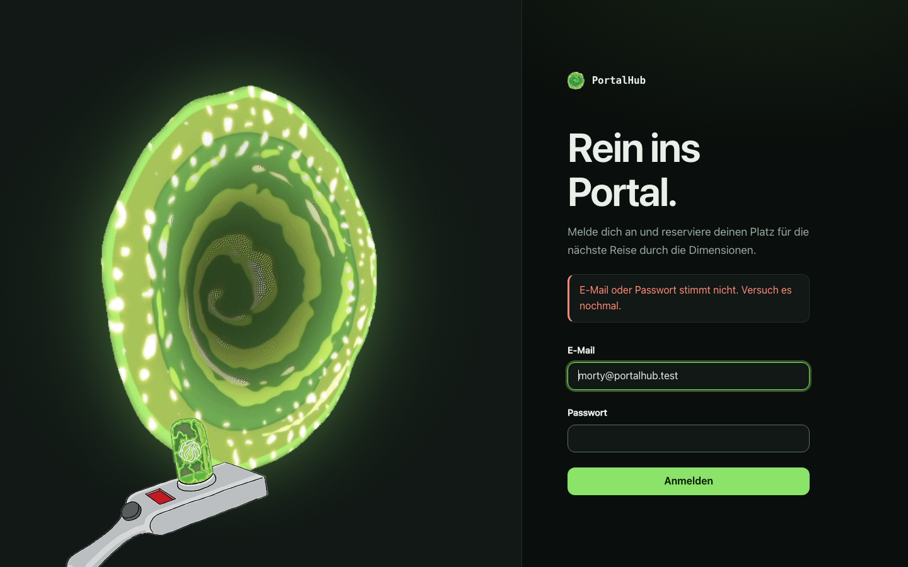 Falsches Passwort: Meldung, die E-Mail bleibt stehen |
|  Portalübersicht mit freien Plätzen, Sitzpunkten und AUSGEBUCHT | 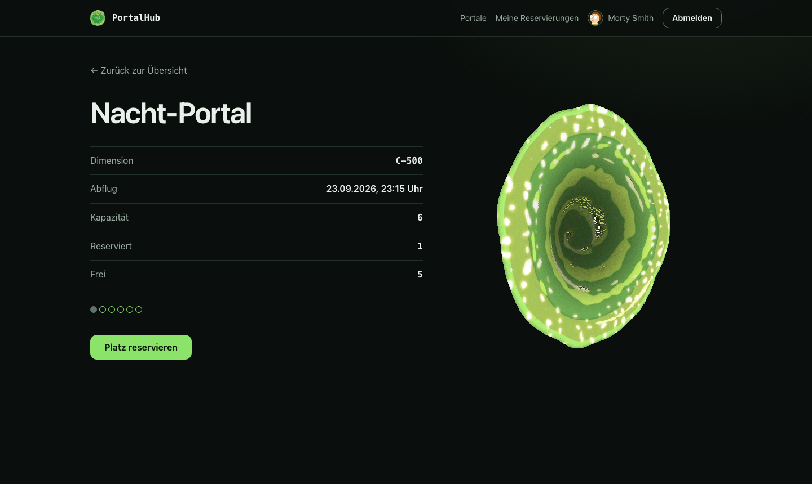 Details mit Platz reservieren |
| 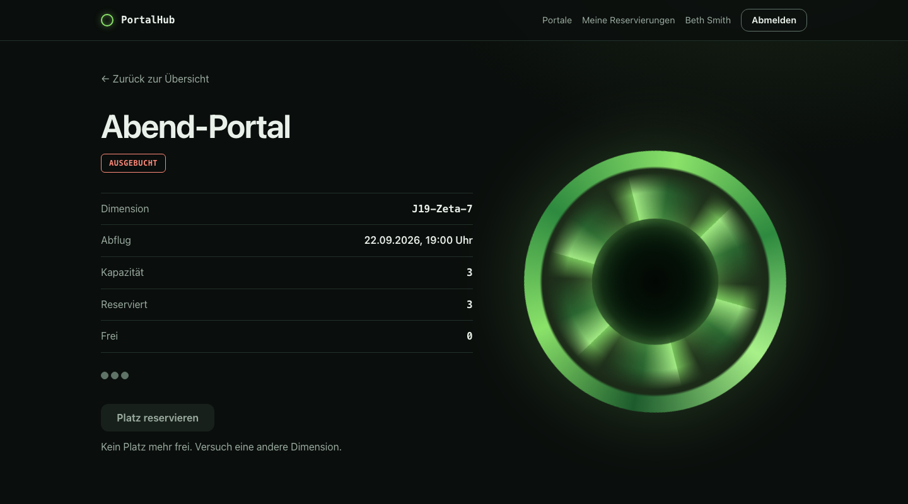 Volles Portal: Button inaktiv | 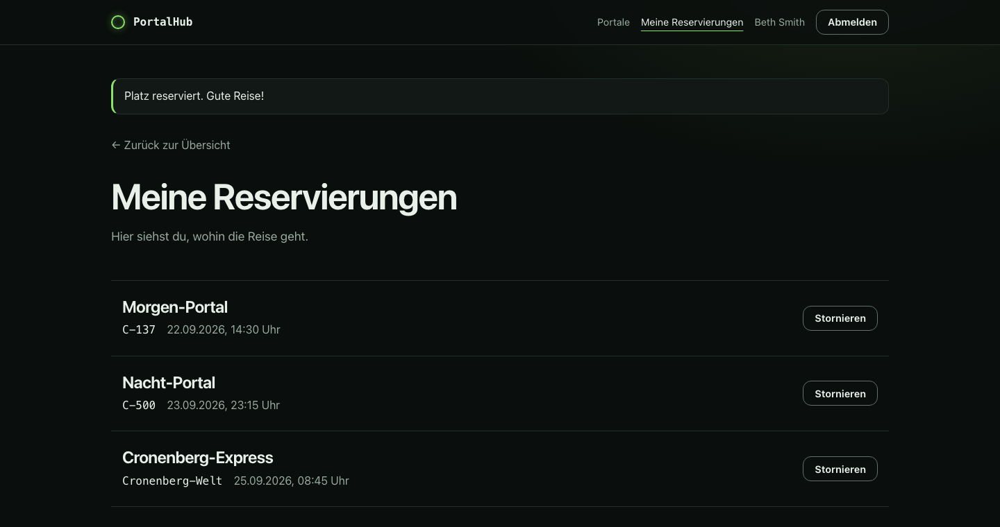 Nach dem Reservieren: Meldung und neue Reservierung |
| 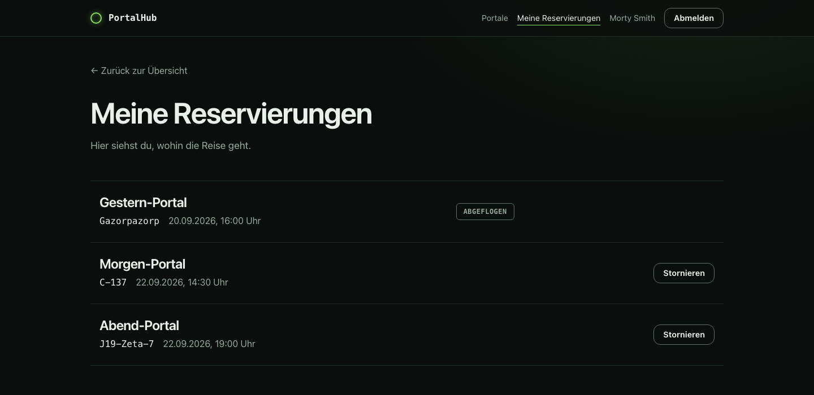 Meine Reservierungen | 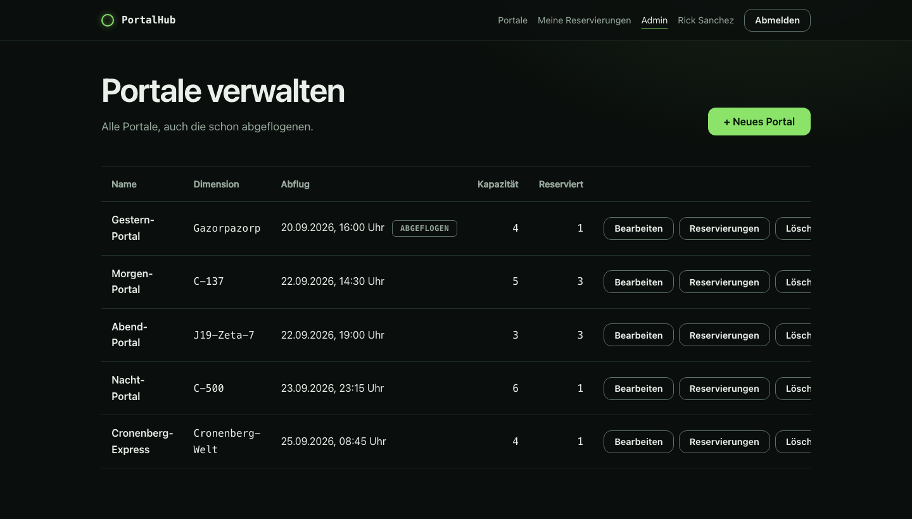 Admin: alle Portale |
| 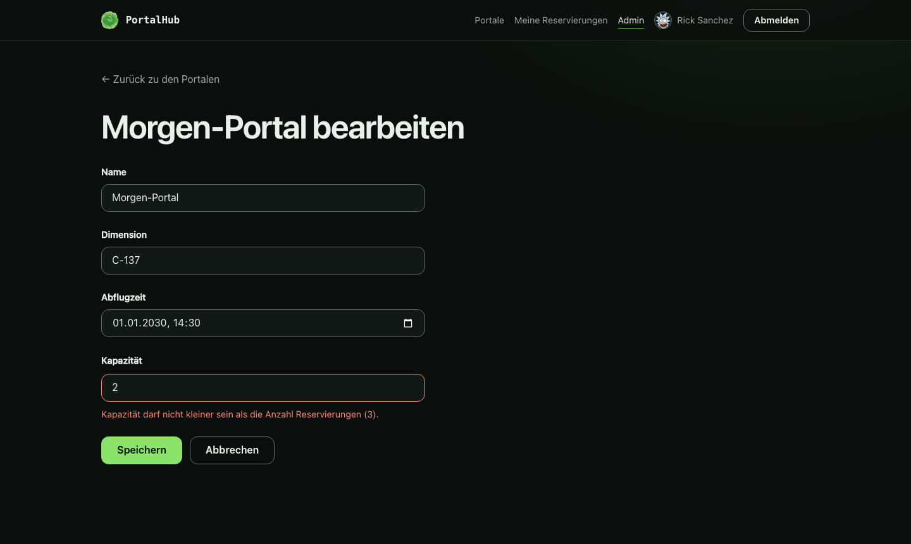 Admin: Kapazität unter der Zahl der Reservierungen | 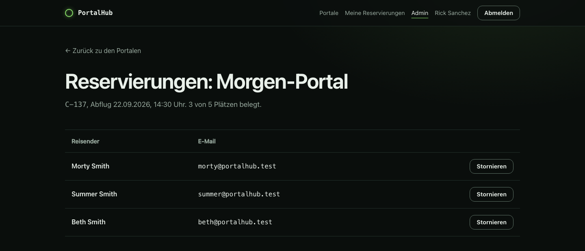 Admin: Reservierungen eines Portals |
| 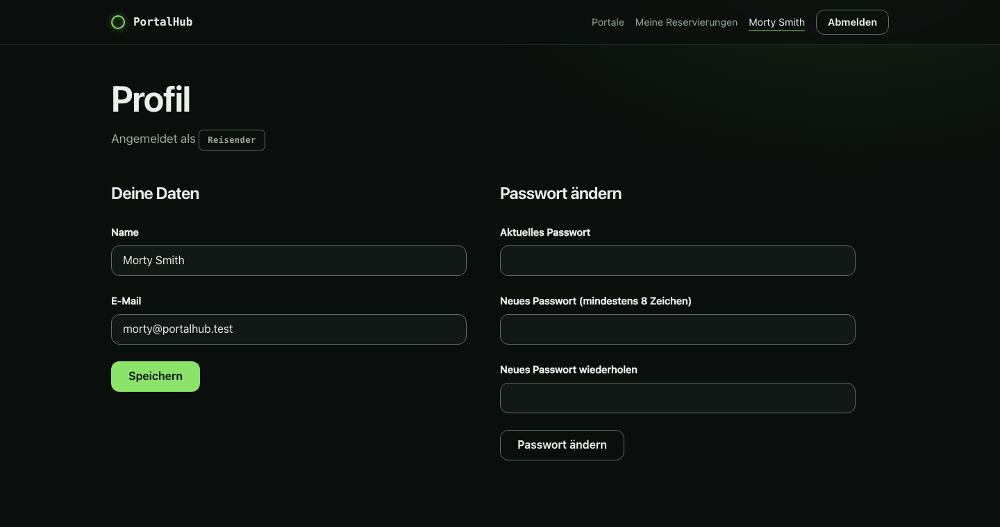 Profil: Daten und Passwort ändern | 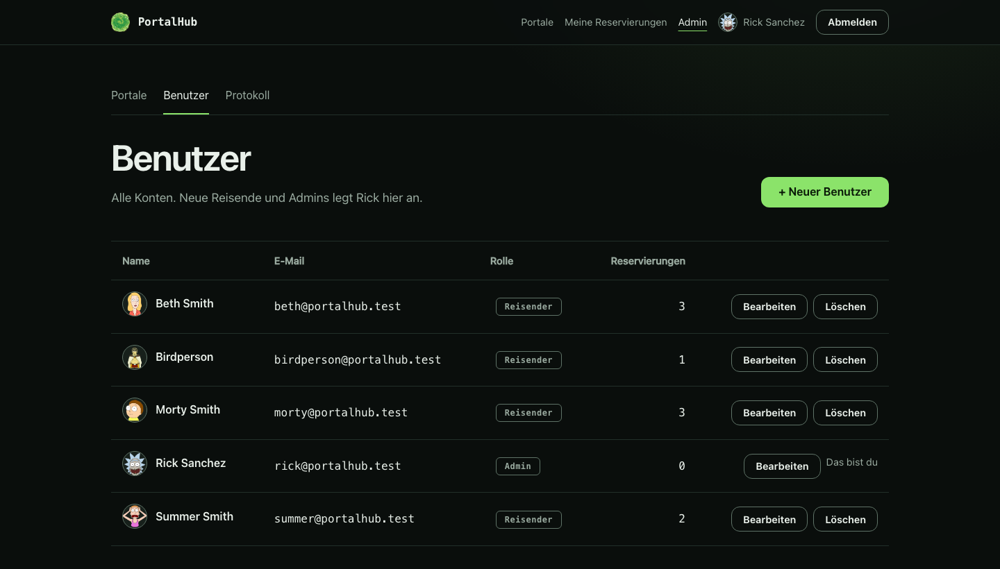 Admin: Benutzerverwaltung |
| 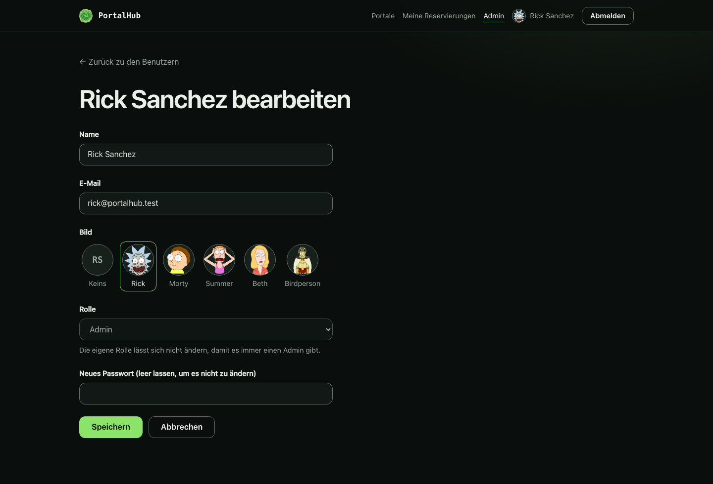 Eigenes Konto bearbeiten: die Rolle ist gesperrt | 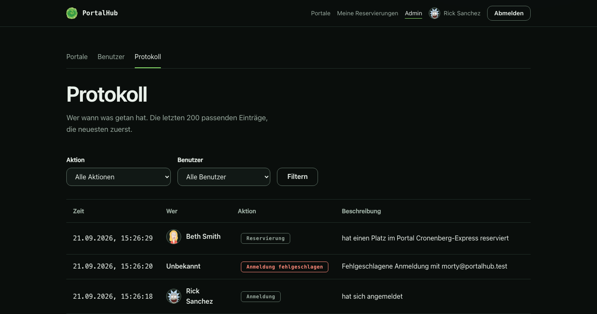 Admin: Aktivitätsprotokoll |
|  Fehlerseite 404 | |

Die Meldung "Portal voll! ..." beim Versuch, ein volles Portal zu reservieren, erscheint auf der Detailseite. Sie ist in `bookings_test.rb` geprüft.

### ERM, wie umgesetzt

| Tabelle | Spalten |
| --- | --- |
| `users` | `id`, `name`, `email_address` (eindeutig), `password_digest`, `role` (`traveler` oder `admin`) |
| `portals` | `id`, `name`, `dimension`, `departure_time`, `capacity` |
| `bookings` | `id`, `user_id`, `portal_id`, eindeutig pro Paar `user_id` und `portal_id` |
| `sessions` | `id`, `user_id`, `ip_address`, `user_agent` (Anmeldung, nicht Teil des fachlichen Modells) |
| `activities` | `id`, `user_id` (leer bei fehlgeschlagener Anmeldung und nach dem Löschen des Benutzers), `user_name` (Name zum Zeitpunkt), `action`, `details`, `created_at` (Aktivitätsprotokoll) |

Beziehungen: `users` 1 zu n `bookings`, `portals` 1 zu n `bookings`. Freie Plätze werden nie gespeichert, sondern immer als Kapazität minus Anzahl Reservierungen berechnet. Diagramme: [erm.svg](diagrams/erm.svg) (Antrag) und [erm-umgesetzt.svg](diagrams/erm-umgesetzt.svg) (mit den umgesetzten Spaltennamen).

## 2. Abweichungen vom genehmigten Antrag

Die Begründungen stehen in [spec.md](spec.md), Abschnitt "Präzisierungen und Abweichungen nach der Genehmigung". Zusammengefasst:

- **Spaltennamen:** `email_address` und `password_digest` statt `email` und `password`. Der Rails-Authentifizierungsgenerator verwendet diese Namen, und ein Klartext-Passwort darf nicht gespeichert werden. Dazu kommt die Tabelle `sessions`.
- **Qualitätsattribute:** Aus sechs allgemeinen Aussagen wurden fünf überprüfbare, weil die Wegleitung "sicher" oder "benutzerfreundlich" allein nicht genügen lässt.
- **Ein Portal ist ein einmaliger Abflug** mit Datum und Uhrzeit, keine wiederkehrende Verbindung ([ADR-0001](adr/0001-portal-is-a-one-off-departure.md)). Die Wireframes zeigen der Kürze halber nur die Uhrzeit.
- **Fehlende Berechtigung:** Ein Reisender, der eine Admin-Seite aufruft, wird auf die Startseite geleitet und sieht dort "Berechtigung fehlt." statt einer eigenen Fehlerseite.
- **Erweiterungen:** Benutzerprofil, Benutzerverwaltung, Aktivitätsprotokoll und deutsche Fehlerseiten kamen nach dem Antrag dazu, weil der Kompetenznachweis sie verlangt (siehe oben).
- **Mobile Ansicht** ist kein Ziel. Die Applikation ist für den Desktop-Browser gebaut, einfache einspaltige Fallbacks sind vorhanden, aber nicht geprüft.
- **Sperre bei der Kapazitätsänderung:** Sie läuft wie beim Reservieren unter `Portal#with_lock`. Auf SQLite ist die explizite Sperre dort allerdings redundant, weil `save` bereits eine eigene Schreibtransaktion um die Validierung öffnet (Begründung und Konsequenz in [ADR-0002](adr/0002-capacity-enforced-with-portal-lock.md)). Beim Reservieren ist sie dagegen zwingend nötig.

## 3. Prüfung der Qualitätsattribute

### 1. Datenkonsistenz: erfüllt

Anforderung: Versuchen zehn Reisende gleichzeitig, den letzten freien Platz zu reservieren, wird genau eine Reservierung gespeichert.

- `test/models/portal_concurrency_test.rb` startet zehn Threads mit je eigener Datenbankverbindung und prüft: genau eine Reservierung gelingt, neun sehen das volle Portal, in der Datenbank steht genau eine Reservierung. Ein zweiter Fall prüft dasselbe für ein Portal mit vier Plätzen.
- **Grenze dieses Tests:** Das Zeitfenster zwischen Zählen und Reservieren ist so klein, dass dieser Test auch ohne Sperre bestand. Er beweist die Sperre deshalb nicht allein.
- **Der eigentliche Beweis** ist ein weiterer Test in derselben Datei: Eine Reservierung wird mitten in ihrer Transaktion festgehalten, während eine zweite versucht, denselben letzten Platz zu reservieren. Mit `with_lock` muss die zweite warten und sieht das volle Portal. Entfernt man `with_lock` aus `Portal#reserve_seat_for`, schlägt dieser Test fehl (so geprüft).
- Die Suite lief wiederholt (fünf volle Durchläufe hintereinander) ohne Ausfall.

### 2. Berechtigungen: erfüllt

Anforderung: Ein Reisender, der eine Admin-Seite aufruft, sieht "Berechtigung fehlt" und verändert nichts. Ein nicht angemeldeter Benutzer wird zum Login geleitet und kann nicht reservieren.

- `test/integration/admin_access_test.rb` ruft **alle 15** Admin-Endpunkte (Portale: Liste, neu, anlegen, bearbeiten, ändern, löschen, Reservierungen ansehen, Reservierung stornieren; Protokoll; Benutzer: Liste, neu, anlegen, bearbeiten, ändern, löschen) als Besucher und als Reisender auf und vergleicht vorher und nachher den Datenbestand: Es ändert sich nichts. Der Admin kommt auf alle Seiten.
- Besucher werden auch bei Reservieren, "Meine Reservierungen" und Stornieren zum Login geleitet (`bookings_test.rb`, `my_bookings_test.rb`).
- Fremde Reservierungen sind für Reisende ein 404, auch für Rick über den Reisenden-Weg. Beim Reservieren wird eine mitgeschickte fremde `user_id` ignoriert.

### 3. Reaktionszeit: erfüllt

Anforderung: Die Portalübersicht mit 100 Portalen wird bei zehn gleichzeitigen Anfragen innerhalb von 2 Sekunden ausgeliefert.

- **Aufbau:** Frische Kopie des Projekts, Entwicklungsserver (`bin/dev`), 104 kommende Portale mit insgesamt 307 Reservierungen, angemeldet als Reisender. Fünf Runden mit je zehn gleichzeitigen Anfragen an die Übersicht (`curl` mit zehn Prozessen). Die Seite hatte 104 Portalzeilen und rund 87 KB.
- **Ergebnis:** Die langsamste Anfrage dauerte in allen fünf Runden höchstens 0,125 Sekunden, die schnellste 0,018 Sekunden. Alle 50 Anfragen antworteten mit Status 200.
- **Einschränkung:** Gemessen lokal im Entwicklungsmodus, auf dem Entwicklungsrechner und ohne Netzwerk. Im Produktionsmodus ist die Applikation eher schneller. Die Übersicht lädt die Reservierungen mit `includes`, es gibt keine Abfrage pro Zeile.

### 4. Bedienbarkeit: nach dem Aufbau der Seiten erfüllt, manueller Durchlauf offen

Anforderung: Ein angemeldeter Reisender erreicht die Reservierung eines Platzes von der Portalübersicht aus in höchstens zwei Klicks und erhält eine Bestätigung.

- Weg: Übersicht, Klick auf "Details", Klick auf "Platz reservieren". Das sind zwei Klicks. Danach landet der Reisende auf "Meine Reservierungen" mit der Meldung "Platz reserviert. Gute Reise!" (siehe Screenshot 06).
- Geprüft am Aufbau der Seiten, durch die Integrationstests und durch einen automatisierten Durchlauf in Brave (Übersicht, Klick auf "Details", Klick auf "Platz reservieren", danach Weiterleitung mit der Meldung). Der im Antrag vorgesehene manuelle Durchlauf durch eine Person ist nicht erfolgt (siehe offene Punkte).

### 5. Kompatibilität: teilweise geprüft

Anforderung: Login, Portalübersicht, Reservierung und Stornierung funktionieren in den aktuellen Versionen von Chrome, Firefox und Safari.

| Browser | Ergebnis |
| --- | --- |
| Brave 152 (Chromium, interaktiv) | **20 von 20 Prüfungen bestanden** (`node script/browser_check.mjs`, gesteuert über das DevTools-Protokoll, mit echtem JavaScript): Reservieren mit Weiterleitung und Meldung, Stornieren und Löschen mit den **echten Bestätigungsdialogen** (Abbrechen löscht nichts, Bestätigen löscht, der Dialog nennt Portal und Anzahl Reservierungen), Abweisung eines Reisenden im Admin-Bereich, Benutzerverwaltung mit Lösch-Dialog, Profil und Protokoll, keine JavaScript-Fehler in der Konsole. Brave nutzt dieselbe Engine wie Chrome. Chrome selbst wurde damit nicht getestet. |
| Chrome (aktuell, Headless) | Alle Bildschirme rendern korrekt, siehe Screenshots. Dazu kommen die Integrationstests, das sind aber keine Browsertests. |
| Firefox | **Nicht geprüft.** Auf dem Entwicklungsrechner ist Firefox nicht installiert. |
| Safari | **Nicht geprüft.** Safari ist auf dem Entwicklungsrechner vorhanden, die automatische Steuerung ist aber ausgeschaltet (Versuch mit `safaridriver`: "Allow remote automation" in den Safari-Einstellungen unter "Entwickler" ist nicht aktiviert). Die Einstellung wurde bewusst nicht verändert. |

Was sich ohne Browser sagen lässt: Die Applikation lässt über `allow_browser :modern` nur Safari ab 17.2, Chrome ab 120, Firefox ab 121 und Opera ab 106 zu und weist ältere Browser ab. Die eingesetzten CSS-Funktionen (`color-mix`, `conic-gradient`, `mask`, `100dvh`, `:focus-visible`, `aspect-ratio`) werden nach dem bekannten Stand der Browserunterstützung von diesen Versionen unterstützt. Das ist keine Messung und sollte an den Browsern selbst gegengeprüft werden. Voraussichtlich kleine Unterschiede in älteren zugelassenen Safari-Versionen betreffen nur das Aussehen (zum Beispiel den Weichzeichner der Kopfzeile, für den ein `-webkit-`-Präfix gesetzt ist, und den Zeilenumbruch von Überschriften), nicht die Funktion.

**Was in Firefox und Safari von Hand zu prüfen ist** (jeweils als Rick und als Reisender, Passwort `wubba-lubba`):

1. Anmelden mit falschem, dann mit richtigem Passwort.
2. Portalübersicht: freie Plätze, Sitzpunkte, "AUSGEBUCHT" beim Abend-Portal.
3. Details öffnen, "Platz reservieren" klicken: Meldung erscheint, Reservierung steht in der Liste.
4. "Stornieren" klicken: **Es muss zuerst ein Bestätigungsdialog erscheinen**, erst danach wird gelöscht.
5. Als Rick: Portal anlegen (Datumsfeld bedienbar), Kapazität unter die Zahl der Reservierungen setzen (Fehlermeldung am Feld), Portal mit Reservierungen löschen (Dialog nennt die Zahl).

## 4. Offene Punkte

- **Manueller Durchlauf** in Firefox und Safari (siehe oben) und das Ergebnis in der Tabelle eintragen. Derselbe Durchlauf ersetzt den im Antrag vorgesehenen manuellen Test der Bedienbarkeit (Attribut 4).
- **Bestätigungsdialoge:** Die Integrationstests prüfen nur, dass `data-turbo-confirm` am Formular steht. Dass der Dialog wirklich erscheint, macht Turbo per JavaScript. Das ist in Brave (Chromium) mit echtem Browser bestätigt (`script/browser_check.mjs`). In Firefox und Safari steht es noch aus (Schritt 4 und 5 der Checkliste).
- **PDF-Export der Dokumentation** mit Titelblatt (Modulname, Datum, Vor- und Nachname, Schulklasse). Diese Angaben fehlen hier bewusst, weil sie nicht im Projekt stehen.
- **Präsentation** (Folien und Live-Demo) ist nicht Teil dieses Repositorys.
- **Kein Testing Cheatsheet:** Die Wegleitung verweist auf ein Testing Cheatsheet der Schule, das im Projekt nicht vorliegt. Die Tests folgen den Rails-Standards (Minitest, Fixtures, Integrationstests).

## 5. Glossar und Architekturentscheidungen

[CONTEXT.md](../CONTEXT.md) und die beiden ADRs wurden am Ende Punkt für Punkt gegen den Code abgeglichen (abgeflogene Portale sind für Reisende ausgeblendet, Stornieren löscht die Reservierung, die Kapazität kann nie unter die Anzahl Reservierungen sinken, freie Plätze werden nur berechnet, "Journey" wird nirgends gespeichert). Dabei fand sich ein Widerspruch: Das Glossar sagte, der Admin könne jede Reservierung stornieren, der Code verweigert das aber bei abgeflogenen Portalen. Das Glossar wurde korrigiert. ADR-0001 gilt unverändert, ADR-0002 enthält seit der Umsetzung der Admin-Verwaltung die Erkenntnis zur Kapazitätsänderung.
